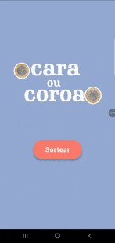

# 🎲 Cara ou Coroa

Aplicativo desenvolvido em **Flutter** que simula um jogo de **Cara ou Coroa**, exibindo o resultado do sorteio de forma visual e interativa.

O projeto foi criado com foco em aprendizado e prática de conceitos fundamentais do Flutter, mantendo organização, identidade visual e uma interface simples.

---

## 📱 Demonstração e Funcionalidades

| Funcionalidades                                                                                                                                                                                                                                                                                                                                                                                                           |                       Demonstração                        |
|:--------------------------------------------------------------------------------------------------------------------------------------------------------------------------------------------------------------------------------------------------------------------------------------------------------------------------------------------------------------------------------------------------------------------------|:---------------------------------------------------------:|
| - Sorteio aleatório entre **Cara** e **Coroa**.<br><br>- Exibição dinâmica da imagem correspondente ao resultado.<br><br>- Efeito visual de iluminação (glow) ao redor da moeda sorteada.<br><br>- Texto indicando o resultado.<br><br>- Botão para retornar à tela inicial. |  |

---

## 🧠 Conceitos utilizados

- `StatefulWidget`
- Passagem de parâmetros entre telas
- Controle de estado com `widget`
- Navegação com `Navigator`
- Layout com `Column`, `Stack` e `Spacer`
- Uso de `BoxShadow` para efeitos visuais
- Centralização da paleta de cores (`AppColors`)

---

## 🎨 Identidade visual

A identidade visual do projeto é baseada em uma paleta de cores definida em um arquivo separado, garantindo consistência em toda a aplicação.

- Azul escuro para botões e textos
- Rosa claro (`pinkBaby`) para o efeito de iluminação da moeda

---

## 🗂️ Estrutura do projeto

```text
lib/
├── theme/
│   └── app_colors.dart
├── pages/
│   └── jogar.dart
└── main.dart

assets/
├── images/
│   ├── moeda_cara.jpg
│   └── moeda_coroa.jpg
└── gif/
    └── cara_ou_coroa.gif

---

## 🏗️ Como Rodar o Projeto

- `Pré-requisitos:`
  - Flutter SDK instalado
  - Emulador ou dispositivo físico configurado

1.  **Clone o repositório:**
    ```bash
    git clone https://github.com/TatianeMarinho/cara_ou_coroa_app.git

    ```
2.  **Instale as dependências:**
    ```bash
    flutter pub get
    ```
3.  **Execute o aplicativo:**
    ```bash
    flutter run
    ```

---
<p  style="text-align: center;">Desenvolvido com ❤️ durante os estudos de Flutter</p>
